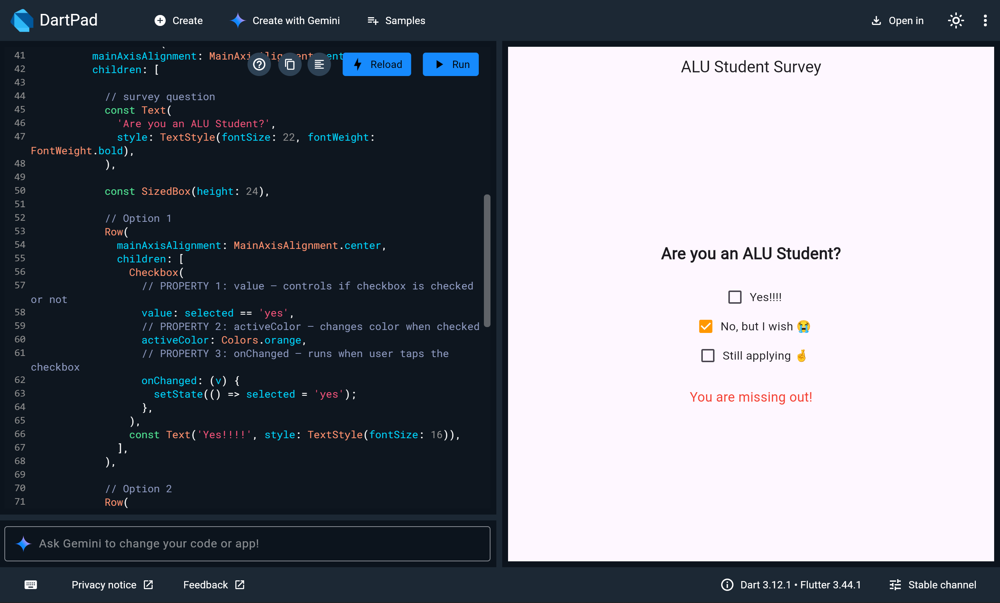

# Checkbox Widget Demo

A simple Flutter survey app that demonstrates the Checkbox widget.

## How to Run

1. Go to [dartpad.dev](https://dartpad.dev)
2. Paste the code from `lib/main.dart`
3. Click Run

## Widget: Checkbox

The Checkbox widget lets users select or deselect an option.
It is commonly used in forms and surveys.

## Three Properties Demonstrated

| Property | What it does |
|----------|-------------|
| `value` | Controls whether the checkbox is checked (true) or unchecked (false) |
| `activeColor` | Changes the color of the checkbox when it is checked |
| `onChanged` | A function that runs every time the user taps the checkbox |

## Screenshot

